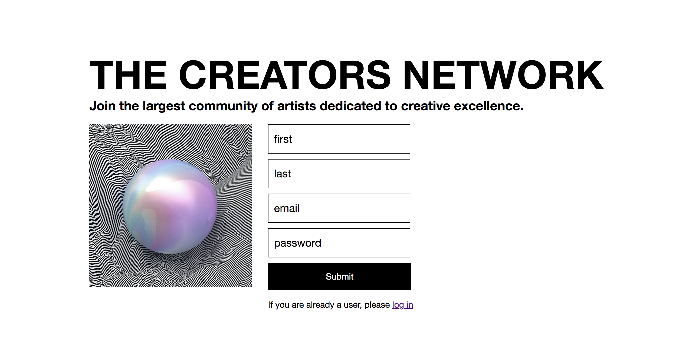

# social-network
a social network built with react, redux and socket.io
# The Creators Network

The Creators Network is a single page application that has a similar functionality to a social network. Users can register, login, add or remove friends, chat in real time or write on each other's walls. The project was completed during my time at Spiced Academy and it was built using React.js, Redux and Socket.io. It features both class and function components.

## Tech Stack

- HTML, CSS, Javascript
- React.js (including Hooks)
- Redux
- Node.js
- Express
- AWS / S3
- PostgreSQL

## Features

- Log in / Registration / Log out
- Upload / change avatar
- Create / edit bio
- Find users
- Other users profile
- Chat - real-time public chat with anyone registered
- Post on other user's wall
